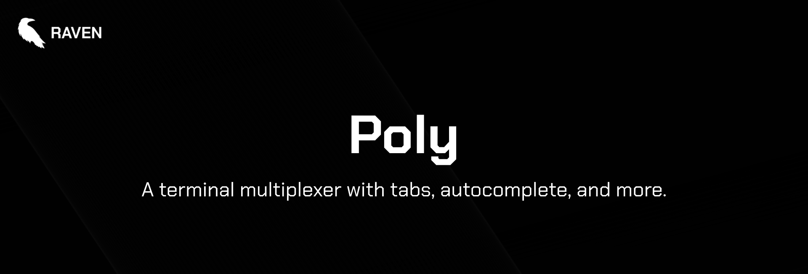

  

> [!NOTE]
> All of our free software is designed to respect your privacy, while being as simple to use as possible. Our free software is licensed under the [BSD-3-Clause license](https://ravendevteam.org/files/BSD-3-Clause.txt). By using our software, you acknowledge and agree to the terms of the license.

A terminal multiplexer with tabs, autocomplete, and more.

Made for Windows 11 and Linux.

## Installation
You can download Poly [here](https://ravendevteam.org/software/poly).

To compile from source, make sure you have Python 3.12.4, and Nuitka. Install the necessary dependencies from `requirements.txt`, then run `build.bat`.

## Usage
- **Creating a new tab:** CTRL + T
- **Closing current tab:** CTRL + W
- **Switching to next tab:** Tab
- **Switching to previous tab:** Shift + Tab
- **.polyrc:** Create a .polyrc file in your home directory to define initial commands to execute.

## Screenshots

## Authors & Contributors

- [Raven Development Team](https://ravendevteam.org/)
- [Icons by Icons8](https://icons8.com/)
- [lilafian](https://github.com/lilafian)
- [swordmasterliam](https://github.com/swordmasterliam)
- [rhhen122](https://github.com/rhhen122)
